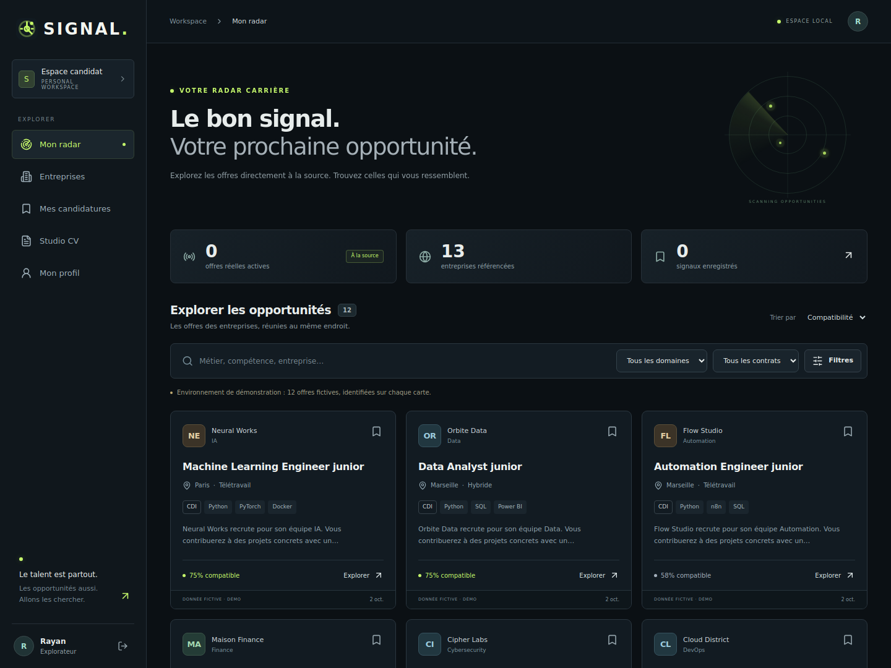

# SIGNAL

**Les opportunités à la source.**

MVP SaaS local : explorer les annonces des sites carrière, recevoir un matching explicable, suivre ses candidatures et créer des CV ciblés sans inventer son parcours. Interface responsive graphite/lime, inspiration cyberpunk sobre.



## Démarrage en 3 commandes

Prérequis : **Docker Desktop** (conteneurs Linux) ou Docker Engine + Compose v2, et Python 3 pour générer les secrets. Décompresser l’archive, ouvrir un terminal dans le dossier `signal` :

```bash
python scripts/init_env.py
docker compose up --build -d
docker compose ps
```

Sur certains systèmes, utiliser `python3` à la place de `python`.

- Application : **http://localhost:8080**
- Documentation API : **http://localhost:8080/api/docs**
- Santé : **http://localhost:8080/api/health**
- Administrateur : `admin@signal.local`, mot de passe unique affiché par `init_env.py` et conservé dans `.env`.
- Candidat : créer son propre compte dans l’interface.

Attendre la fin de la migration et des services `healthy`. Le premier build télécharge les dépendances ; PostgreSQL et Redis persistent dans des volumes Docker.

**12 annonces fictives multi-secteurs sont chargées par défaut**, dont 6 centrées Tech/Data/IA/Cyber/Cloud/Automation. Elles sont marquées « Démo », ne sont jamais crawlées et n’ouvrent pas de faux formulaire de candidature. Aucune annonce réelle n’est préchargée.

## Premier parcours

1. Créer son compte candidat.
2. **Mon profil** : compétences, contrats, domaines, ville, modes de travail ; enregistrer.
3. **Mon radar** : filtrer, ouvrir une annonce, lire le détail du score.
4. Enregistrer une offre ; suivre sa progression et ses notes privées dans **Mes candidatures**.
5. **Studio CV** : importer un PDF texte/DOCX/TXT ou coller son CV.
6. Depuis une offre, **Adapter mon CV**, relire puis télécharger DOCX/TXT. Le parcours original reste inclus.

## Découverte automatique

SIGNAL trouve seul des employeurs et des offres, sans saisie manuelle :

1. **Catalogue de départ** : employeurs français dont le job board public (Greenhouse, Lever, Ashby, Recruitee) a été vérifié en direct (`backend/app/data/catalog.csv`). Chargé au démarrage si `SEED_CATALOG=true`, collecté dans les 5 minutes.
2. **Agrégateurs** : chaque offre révèle un employeur, créé automatiquement (« via France Travail », etc.).
   - **France Travail** (toute la France, tous secteurs) : créer un compte gratuit sur [francetravail.io](https://francetravail.io), créer une application, **l’abonner à l’API « Offres d’emploi v2 »**, puis renseigner `FT_CLIENT_ID` et `FT_CLIENT_SECRET` dans `.env`. Collecte horaire ; au premier passage, rattrapage des `FT_BACKFILL_HOURS` dernières heures (48 h par défaut), repris par tranches si nécessaire. `FT_DEPARTEMENTS=13,75` limite la zone.
   - **Adzuna** (facultatif) : clés gratuites sur developer.adzuna.com → `ADZUNA_APP_ID`, `ADZUNA_APP_KEY`.
   - **Arbeitnow** (offres situées en France) : sans clé, actif par défaut. Remotive a été écarté : son `robots.txt` interdit `/api/*` aux robots.
3. **Découverte des pages carrière** : toutes les 5 minutes, un lot d’employeurs découverts est sondé (site officiel s’il est connu, puis identifiants probables sur Greenhouse, Lever, Ashby, Recruitee). Un board n’est retenu que si ses données publiques nomment l’employeur. L’employeur passe alors en **collecte directe à la source** (plus complète, fermeture automatique) ; ses offres d’agrégateur ne sont plus importées.

Après modification de `.env` : `docker compose up -d --force-recreate api worker scheduler`. Suivi dans **Collecte → Sources automatiques** (bouton « Lancer » pour forcer un passage) et via `docker compose logs -f worker`.

Les offres d’agrégateurs ne font jamais partie d’un instantané complet : elles sont fermées après `AGGREGATOR_TTL_DAYS` jours sans nouvelle observation (30 par défaut). La source, la date de mise à jour et le lien d’origine sont affichés sur chaque offre, conformément aux licences (France Travail, Adzuna, Arbeitnow).

Étendre le catalogue : ajouter des lignes `name,website_url,industry` à `backend/app/data/catalog_candidates.csv`, puis vérifier en direct :

```bash
docker compose run --rm --no-deps -v ./backend:/app worker python -m app.build_catalog app/data/catalog_candidates.csv app/data/catalog.csv
```

## Ajouter une entreprise manuellement

1. Se connecter avec le compte administrateur.
2. **Moteur de collecte → Ajouter une entreprise**.
3. Renseigner son vrai site officiel et, si possible, l’URL carrière.
4. Si l’ATS est connu, sélectionner le connecteur et son identifiant public exact. Exemple : `https://jobs.ashbyhq.com/nom-du-board` → identifiant `nom-du-board`.
5. Cliquer **Collecter** ; consulter le journal, le statut et la couverture. Actualisation toutes les 15 secondes.
6. Sans URL carrière, le mode générique recherche les liens carrière, sitemap et chemins usuels.

Aucun CAPTCHA/Cloudflare n’est contourné. Une source bloquée est signalée.

`robots.txt` suit la RFC 9309 avec une prudence production, cache 24 h en base :

| Réponse `robots.txt` | Décision |
|---|---|
| 200 | Règles appliquées : chemin le plus spécifique, `Allow` gagne à égalité, jokers `*` et `$` |
| 404 / 410 | Aucune restriction |
| 401 / 403 | Pages publiques uniquement ; aucune authentification n’est jamais envoyée |
| 429, 5xx, timeout, DNS, TLS | Nouvel essai plus tard ; une copie valide de moins de 30 jours peut être réutilisée |
| 200 non analysable (page HTML) | `unknown` journalisé, aucune règle |
| `Disallow` correspondant | Bloqué |

API implémentées : **Greenhouse, Lever global/EU, Ashby, Recruitee**. **SmartRecruiters** : connecteur présent mais son `robots.txt` interdit l’API à tous les robots sauf LinkedInBot ; il reste donc bloqué. HTML générique : JobPosting JSON-LD. **Workday, Teamtailor, SuccessFactors et Taleo : fallback JSON-LD uniquement, pas d’API dédiée.** France Travail et Adzuna sont des API sous licence utilisées avec vos propres identifiants, hors du crawler.

### Importer un catalogue

Remplir `docs/companies-template.csv` (UTF-8). Import administrateur :

```bash
docker compose cp docs/companies-template.csv api:/tmp/companies.csv
docker compose exec api python -m app.import_companies /tmp/companies.csv
```

Domaines existants ignorés. Une ligne invalide interrompt l’import avec son numéro ; les précédentes restent enregistrées. Collectes planifiées au prochain cycle.

## Configuration

| Variable | Usage |
|---|---|
| `POSTGRES_PASSWORD` | Secret de base alphanumérique, généré automatiquement |
| `ADMIN_EMAIL`, `ADMIN_PASSWORD` | Création initiale de l’administrateur ; modifier `.env` ne réinitialise pas un compte existant |
| `APP_ORIGIN` | Origine exacte, par défaut `http://localhost:8080` |
| `SECURE_COOKIES` | `false` en HTTP local ; `true` en HTTPS |
| `ENVIRONMENT` | `production` dans Compose : opérations limitées refusées si Redis tombe |
| `SEED_DEMO` | Ajout idempotent des données fictives ; `false` ne supprime pas les données existantes |
| `OPENAI_API_KEY` | Facultative, côté serveur uniquement |
| `OPENAI_MODEL` | Modèle Chat Completions JSON compatible, configurable |
| `WEB_PORT` | Port publié sur `127.0.0.1` (8080 par défaut) ; adapter `APP_ORIGIN` |
| `SEED_CATALOG` | Chargement idempotent du catalogue vérifié |
| `FT_CLIENT_ID`, `FT_CLIENT_SECRET` | API France Travail ; vide = source désactivée |
| `FT_DEPARTEMENTS`, `FT_BACKFILL_HOURS` | Zone (vide = France entière) et rattrapage initial |
| `ADZUNA_APP_ID`, `ADZUNA_APP_KEY` | API Adzuna ; vide = source désactivée |
| `ENABLE_ARBEITNOW` | Flux public sans clé |
| `AGGREGATOR_TTL_DAYS` | Fermeture des offres d’agrégateurs non revues |
| `DISCOVERY_BATCH` | Employeurs sondés par cycle de 5 minutes |

Pour activer l’IA : ajouter la clé dans `.env`, puis `docker compose up -d --force-recreate api`. Actualiser la page pour voir l’option. CV et annonce sont envoyés au fournisseur uniquement après sélection explicite de la case de consentement. Sans clé, tout fonctionne avec le moteur extractif local.

**L’appel IA payant n’a pas été exécuté lors de la validation.** Le modèle sélectionne des indices d’extraits originaux, validés avant assemblage ; pas de réécriture libre des expériences.

## Développement sans Docker

SQLite est possible pour l’API locale. Redis reste nécessaire à la collecte ; PostgreSQL est recommandé dès que plusieurs processus écrivent.

```bash
cd backend
python -m venv .venv
# Linux/macOS : source .venv/bin/activate
# PowerShell : .venv\Scripts\Activate.ps1
pip install -r requirements.lock
alembic upgrade head
# Définir SEED_DEMO=true avant cette commande pour les exemples :
python -m app.seed
# Définir APP_ORIGIN=http://localhost:5173 pour Vite :
uvicorn app.main:app --reload
```

Deuxième terminal :

```bash
cd frontend
npm ci
npm run dev
```

Vite transmet `/api` à `127.0.0.1:8000`. Pour les workers, configurer `DATABASE_URL` et `REDIS_URL`, puis lancer séparément :

```bash
celery -A app.tasks.celery worker --loglevel=info --concurrency=2
celery -A app.tasks.celery beat --loglevel=info --schedule=/tmp/signal-celerybeat
```

## Tests

```bash
docker compose run --rm api pytest -q
# Ou dans backend, avec l’environnement virtuel activé :
pytest -q
# Frontend :
cd frontend
npm ci
npm run build
npm audit
```

Navigateur : démarrer API + frontend avec les données de démonstration, `npx playwright install chromium`, puis `npm run test:e2e`. `BASE_URL` permet de cibler `http://localhost:8080` à la place de Vite. Le test crée un compte et des documents fictifs : utiliser une base de développement. Captures dans `docs/`.

Queue réelle avec transport ATS simulé : sur une **base de test migrée** et un Redis de test distinct, lancer depuis `backend` : `python -m tests.queue_smoke`. Un worker de test vérifie l’écriture d’une offre puis supprime ses données. Ne pas partager sa queue avec un worker de production.

CI incluse : tests Python, migration PostgreSQL, contrôle de dérive, build frontend et audit npm. Résultats précis : [docs/VALIDATION.md](docs/VALIDATION.md).

## Exploitation

```bash
docker compose logs -f api worker scheduler
# Sauvegarde PostgreSQL :
docker compose exec -T db pg_dump -U signal signal > signal-backup.sql
# Arrêt sans perte de données :
docker compose down
```

Restaurer avec `psql` dans une base vide préparée à cet effet. Ne pas importer au hasard dans une base active. `docker compose down -v` efface les volumes ; inutile pour les mises à jour.

Dépannage :

- **403 au login** : vérifier `APP_ORIGIN`, notamment `localhost` vs `127.0.0.1`.
- **503 queue** : vérifier Redis et les logs worker.
- **Aucune offre réelle** : vérifier **Collecte → Sources automatiques**, les identifiants France Travail et `docker compose logs worker`.
- **France Travail `invalid_client`** : l’application n’est pas abonnée à l’API « Offres d’emploi v2 » sur francetravail.io.
- **Offre potentiellement close** : absente d’un snapshot complet ; fermeture après 3 omissions et au moins 48 h.
- **PDF sans texte** : fournir un PDF texte, DOCX ou TXT. Pas d’OCR.
- **Port occupé** : changer le port publié ET `APP_ORIGIN`.

## Limites

MVP local, pas une exploitation SaaS publique déjà validée : pas de test de charge, emails, facturation ou SLA. Classement sur les 2 000 offres récentes après filtres, géolocalisation conditionnelle aux coordonnées, compétences identifiées par lexique. France Travail entière représente des dizaines de milliers d’offres par jour : prévoir l’espace disque PostgreSQL, ou restreindre `FT_DEPARTEMENTS`. Un employeur homonyme reste possible malgré la vérification du nom ; l’administrateur peut suspendre sa collecte. Les points d’extension ATS ne sont pas présentés comme des connecteurs propriétaires terminés.

Docker Compose est fourni mais n’a pas pu être lancé dans l’environnement de création, sans Docker. Le moteur HTTP nécessite DNS et accès Internet directs ; un environnement imposant un proxy exige une architecture de sortie adaptée sans retirer les protections SSRF.

Architecture : [docs/ARCHITECTURE.md](docs/ARCHITECTURE.md). Références : [docs/SOURCES.md](docs/SOURCES.md).
